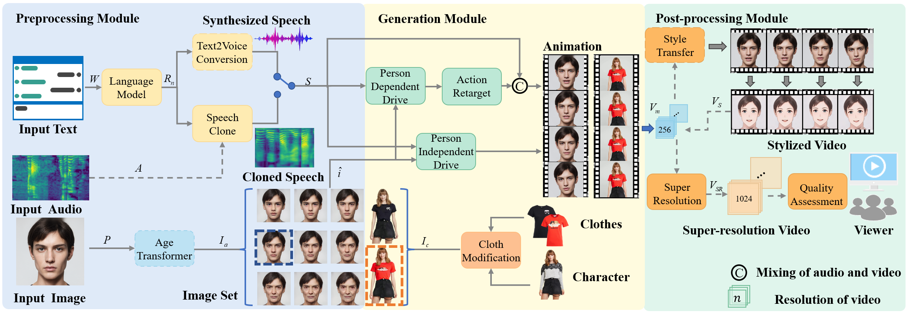

## Usage for CUMT_2D_PhotoSpeaker🚀🚀🚀

We have tested the image in Ubuntu 18.04, and the docker image run successfully.

If you have any problems during the test, please email to aokzyj@126.com/zyj2000@cumt.edu.cn/zyj2000@sjtu.edu.cn



---------------------
 
#### 0. Requirements and Recommends 📑

Machine with GPU and installed with Docker (If you have problems when installing the Docker, please check the following link: [Install Docker Engine](https://docs.docker.com/engine/install/#desktop).)  

We recommend you use the VScode (installed with extensions such as Remote-SSH, [Docker](https://code.visualstudio.com/docs/containers/overview) and Dev Container) to test the image.

#### 1. Get the Docker Image 💡

Here are **two** methods provided to get the docker image. 

1. Docker Hub 

   We have upload the docker image in the [zyj2000/cumt_photo_speaker general | Docker Hub](https://hub.docker.com/repository/docker/zyj2000/cumt_photo_speaker/general), you can download the image follow the command below:

```
sudo docker pull zyj2000/cumt_photo_speaker:v4
```

🌟**If the network status is good, you can download directly through the DockerHub. If you get the image from dockerhub, please skip  '2. Validate the MD5 for the image'. **

2. Baidu yunpan

   The Baidu yunpan LINK:

   https://pan.baidu.com/s/1tiFHlNbe4GAWU7K_IeD7qw 
   code：cumt 

#### 2. Validate the MD5 for the image

Please **MAKE SURE** the MD5 of **cumt_photo_speaker.tar** is **0746b9b2c8b77335c1e46d649ae26f86** in case of the failure in image loading.

```
# windows 
certutil -hashfile cumt_photo_speaker.tar MD5
# linux
md5sum cumt_photo_speaker.tar MD5
```

If the MD5 is not 0746b9b2c8b77335c1e46d649ae26f86, please delete the image and then download the docker image again.

#### 3. Load the image in Linux

```
# load the image
sudo docker load -i cumt_photo_speaker.tar
# check the image
sudo docker images
```

After running the commands, you can see the information:

```
REPOSITORY                   TAG       IMAGE ID       CREATED        SIZE
zyj2000/cumt_photo_speaker   v4        61b180f6d268   2 months ago   69.5GB
```

if you encounter with the problem: invalid diffID for layer xx: expected "sha256:xxx", got "sha: xxx", please refer to **2. Validate the MD5 for the image**

#### 4. Run the image for demo or test in CLI

```
# Test in CLI
sudo docker run --gpus all --name test5 -idt zyj2000/cumt_photo_speaker:v4
# Run the docker
sudo docker exec -it test5 /bin/bash
```

**--gpus all**: Our model is run in GPUs, so '--gpus all' is necessary

if you encounter the problem when adding the --gpus all: 

```
Error response from daemon: could not select device driver ““ with capabilities: [[gpu]]
```

please follow the instructions  below, else you can skip the commands below.

```
distribution=$(. /etc/os-release;echo $ID$VERSION_ID)
curl -s -L https://nvidia.github.io/nvidia-docker/gpgkey | sudo apt-key add -
curl -s -L https://nvidia.github.io/nvidia-docker/$distribution/nvidia-docker.list | sudo tee /etc/apt/sources.list.d/nvidia-docker.list

sudo apt-get update && sudo apt-get install -y nvidia-container-toolkit
sudo systemctl restart docker
```

When entering the container, you will find the information like:

```
(base) root@<container id>:/code# 
# examples: if your container id is 39f89f6a6e1e
(base) root@39f89f6a6e1e:/code# 
```

The '/code' is the work path. We provided 11 demos in this folder and you can use the 'ls' command to find all the files in it：

```
(base) root@39f89f6a6e1e:/code# ls
BasicVSR_PlusPlus-master  DCT-Net      SadTalker_V2  curl2response.py  demo_10.py  demo_3.py  demo_6.py  demo_9.py    source_3.py  ttt.py        web
CUMT_Photospeaker         MockingBird  VITON-HD      demo1.py          demo_11.py  demo_4.py  demo_7.py   static       uploads       web.py
ChatGLM-6B                SAM          VSFA          demo_1.py         demo_2.py   demo_5.py  demo_8.py  model        templates    utils_web.py
```

All the demos are preset and you can just use the command like below to run the demos:

```
(base) root@39f89f6a6e1e:/code# python demo_x.py
# examples: x can be 1 to 11
(base) root@39f89f6a6e1e:/code# python demo_1.py
```

On the other hand, if you come across with the error when running the demo_2.py:

```
nvcc fatal   : Unsupported gpu architecture 'compute_86'
```

It means the GPU's hashrate is too higher, please make it lower by using the command:

```
# Ooen the setting file
vim ~/.bashrc
# Add the command at the bottom of the file
export TORCH_CUDA_ARCH_LIST="8.0"  # set the hashrate to 8.0
# Update
source ~/.bashrc
```

#### 5. Get the results

The generation results of digital human are saved in corresponding  files named as "test_demo_x". If you use VScode, you can find them in the sidebar after installing the plugins Dev Containers and Docker. Otherwise, you can copy the results to your host with the following commands in the host:

```
sudo docker cp <CONTAINER ID>:/code/<test_demo_x> <Destination directory>
# example:
sudo docker cp 39f89f6a6e1e:/code/test_demo_1 .
```

#### 8. More information and Q&A ☕

- If you encounter an error while running demo 2.py:

```
  File "/opt/conda/envs/chat/lib/python3.10/site-packages/requests/adapters.py", line 547, in send
    raise ConnectionError(err, request=request)
requests.exceptions.ConnectionError: ('Connection aborted.', ConnectionResetError(104, 'Connection reset by peer'))
```

It means the GPU's hashrate is too higher, please make it lower by using the command:

```
# GLM下载地址
https://huggingface.co/THUDM/chatglm-6b/tree/main
下载全部内容上传至
sudo docker cp <folder/to/models/in/host> test5:/code
```

## Related Works 🌟🌟🌟

| No. |  Module  |         Related Works          |
| :--: | :------: | :----------------------------: |
|  1   | 交互模块 |           [ChatGLM 6B](https://github.com/THUDM/ChatGLM-6B)          |
|  2   | 文语转换 |            espeaker            |
|  3   | 语音克隆 |          [Mockingbird](https://github.com/babysor/MockingBird)           |
|  4   | 超分辨率 |           [BasicVSR++](https://github.com/ckkelvinchan/BasicVSR_PlusPlus)           |
|  5   | 质量评价 |              [VSFA](https://github.com/lidq92/VSFA)              |
|  6   | 卡通效果 |            [DCT-Net](https://github.com/menyifang/DCT-Net)             |
|  7   | 时间推移 |              [SAM](https://github.com/yuval-alaluf/SAM)               |
|  8  | 语音驱动 |           [SadTalker](https://github.com/OpenTalker/SadTalker)            |
|  9  | 角色换装 |           [VITION-HD](https://github.com/shadow2496/VITON-HD)            |

## License
All material is made available under Creative Commons BY-NC 4.0. You can use, redistribute, and adapt the material for non-commercial purposes, as long as you give appropriate credit by citing our paper and indicate any changes that you've made.

## Citation 😸😸😸
If you find our paper useful, please cite our work as:
```
@inproceedings{zhou2023an,
  title={An Implementation of Multimodal Fusion System for Intelligent Digital Human Generation},
  author={Zhou, Yingjie and Chen, Yaodong and Bi, Kaiyue and Xiong, Lian and Liu, Hui},
  booktitle={National Industrial Software Congress (NISC)},
  year={2023},
}
```

